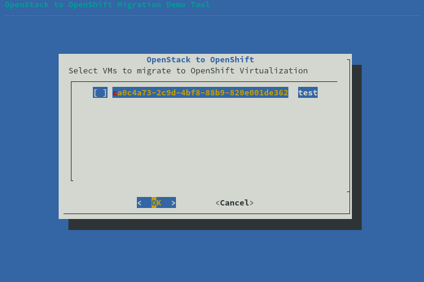
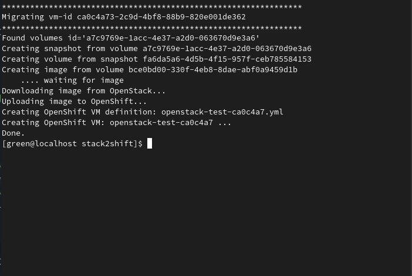

## stack2shift - a proof-of-concept OpenStack to OpenShift migration tool

This is a simple migration tool for bringing OpenStack-hosted VMs over
to OpenShift Virtualization.

stack2shift will talk to OpenStack and present a selection of VMs to migrate:

Once selected, it will perform the actual migration and run the VMs in OpenShift:

This is not intended for real world use. It is just a proof of concept
to demonstrate some of the activities required for successful
migration of simple VM workloads.

### Requirements

stack2shift was tested with Red Hat OpenStack Platform 16.1, and
OpenShift Container Platform 4.5.

stack2shift depends on the following external command line tools:

* `openstack`
* `oc`
* `virtctl`
* `dialog`

In addition, you should be logged into the `openshift-cnv` project of
your OpenShift cluster.

stack2shift was written in Common Lisp and depends on `sbcl` and
QuickLisp.

### Why this isn't production grade

While OpenShift Virtualization is ready for production use, this
simple proof-of-concept migration tool is not and probably never will
be.  stack2shift makes the following assumptions about VMs being
migrated:

* Every VM has a single volume and NIC.
* Every VM's volume is less than 10G in size.
* Every VM fits into a 'tiny' t-shirt size (1 core, 512MB RAM).

Addressing each one of these assumptions seems straight-forward, but
is beyond the scope of this simple demo tool (for now).

### Licensing

Copyright (C) 2020  Anthony Green

stack2shift is Free Software distributed under the terms of the GNU
Affero General Public License, version 3 or later. See the source files
for details.
